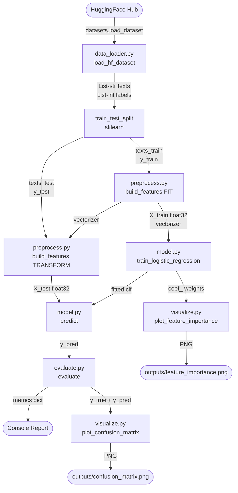
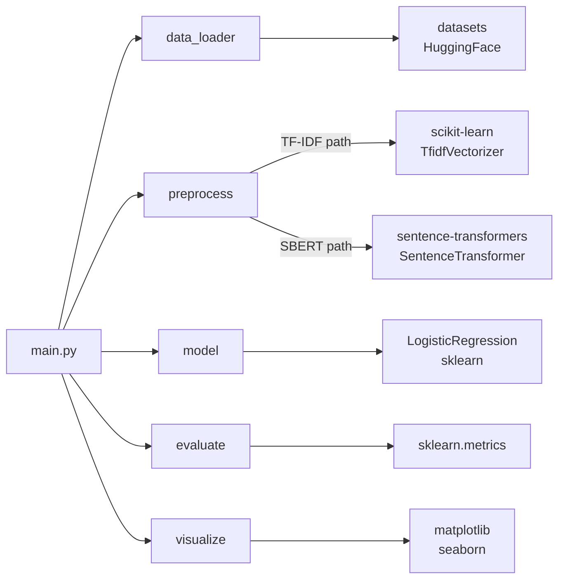
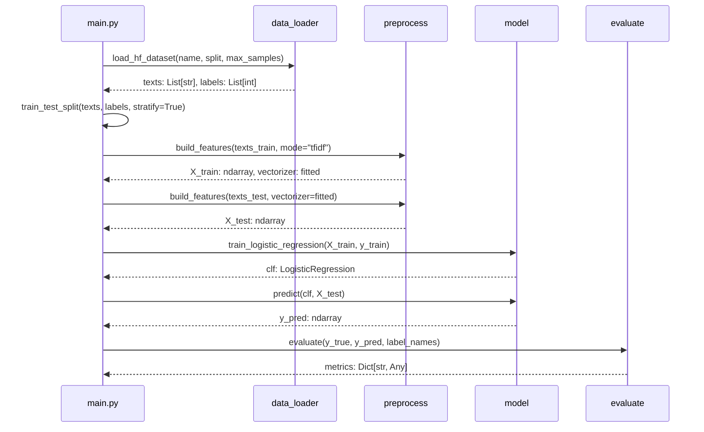
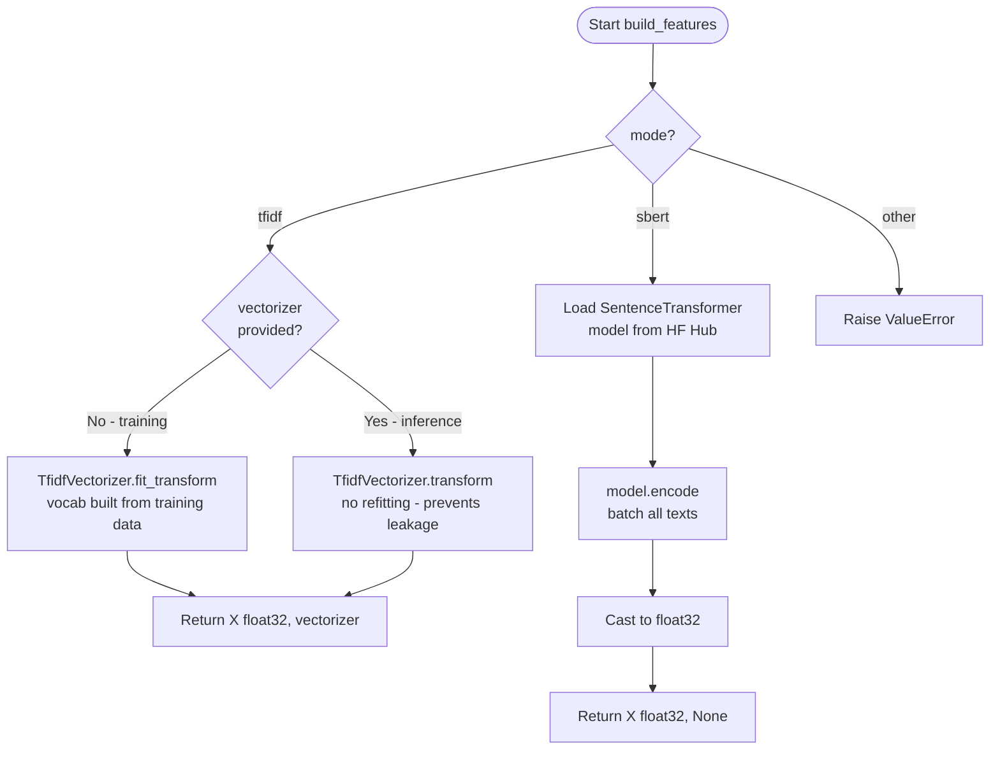
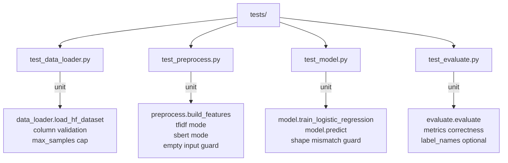

<!-- ============================================================
     README.md  -  Logistic Regression HF Classifier
     ============================================================ -->

<div align="center">

# Logistic Regression HF Classifier

**A production-quality, end-to-end text classification pipeline built on Hugging Face Datasets, scikit-learn, and optional SBERT embeddings.**

[](https://www.python.org/)
[](https://scikit-learn.org/)
[](https://huggingface.co/docs/datasets)
[](LICENSE)
[](https://github.com/psf/black)
[](https://pytest.org/)
[](https://github.com/)
[](http://makeapullrequest.com)

</div>

---

## Table of Contents

- [Overview](#overview)
- [Why This Project Exists](#why-this-project-exists)
- [Architecture](#architecture)
- [Tech Stack](#tech-stack)
- [Project Structure](#project-structure)
- [Pipeline Walkthrough](#pipeline-walkthrough)
- [Quick Start](#quick-start)
- [Configuration Reference](#configuration-reference)
- [Embedding Modes](#embedding-modes)
- [Supported Datasets](#supported-datasets)
- [Evaluation Metrics](#evaluation-metrics)
- [Output Artifacts](#output-artifacts)
- [API Reference](#api-reference)
- [Running Tests](#running-tests)
- [Performance Benchmarks](#performance-benchmarks)
- [Troubleshooting](#troubleshooting)
- [Contributing](#contributing)

---

## Overview

This project provides a clean, modular, and fully configurable **text classification pipeline** that works with any dataset published on the [Hugging Face Hub](https://huggingface.co/datasets). The core classifier is **Logistic Regression** from scikit-learn, which offers an excellent balance between interpretability, speed, and accuracy on NLP tasks - often rivalling far more complex deep learning models when paired with good feature engineering.

The pipeline supports two feature-extraction strategies: a fast **TF-IDF** vectorizer for rapid prototyping and strong baselines, and a **Sentence-BERT (SBERT)** encoder that produces rich semantic embeddings for harder tasks. Both paths feed the same downstream classifier and evaluation logic, making it trivial to compare approaches with a single configuration change.

> [!NOTE]
> This project follows **NASA-style commenting standards** throughout the source code. Every module, class, and function carries structured documentation covering purpose, inputs, outputs, preconditions, failure modes, and verification strategy. This makes the codebase easy to audit, extend, and hand off to new contributors.

---

## Why This Project Exists

Text classification is one of the most common NLP tasks in industry - spam detection, intent recognition, content moderation, topic tagging, and sentiment analysis are all text classification problems at their core. Most tutorials either skip straight to fine-tuning large transformer models (expensive, slow, hard to debug) or produce throwaway notebook code with no structure.

This project fills the gap by demonstrating **how to build a production-quality ML pipeline** that is:

- **Reproducible** - every random seed, split, and hyperparameter is captured in a single configuration dictionary.
- **Leak-free** - the train/test split happens before feature engineering, and the vectorizer fitted on training data is reused (not re-fitted) on the test set.
- **Modular** - each stage lives in its own module with a clean public API, so individual components can be unit-tested, swapped, or reused independently.
- **Observable** - the evaluation step produces both a numeric metrics dictionary and a full per-class classification report, plus visual artifacts for presentations.

> [!IMPORTANT]
> Always split your data **before** fitting the vectorizer. Fitting on the full dataset before splitting causes **data leakage** - the model indirectly sees test-set vocabulary during training, inflating reported accuracy. This pipeline enforces the correct order by design.

---

## Architecture

The following diagram shows the high-level data flow from raw dataset to final evaluation artifacts.



### Module Dependency Graph



### Training vs Inference Data Flow



### Embedding Mode Decision



### Test Suite Architecture



---

## Tech Stack

Understanding the technology choices in this project helps you decide whether to extend it, swap components, or adapt it to a different problem domain.

| # | Layer | Library | Version | Why This Choice |
|---|-------|---------|---------|-----------------|
| 1 | <sub>Dataset I/O</sub> | <sub>huggingface/datasets</sub> | <sub>>=2.19</sub> | <sub>Streaming access to 50 000+ public datasets; automatic caching; Arrow-backed for speed</sub> |
| 2 | <sub>Feature Engineering A</sub> | <sub>sklearn TfidfVectorizer</sub> | <sub>>=1.4</sub> | <sub>Fast, interpretable, no GPU needed; produces sparse matrices; feature importances via coef_</sub> |
| 3 | <sub>Feature Engineering B</sub> | <sub>sentence-transformers</sub> | <sub>>=3.0</sub> | <sub>Semantic dense embeddings; handles paraphrases and synonym variation that TF-IDF misses</sub> |
| 4 | <sub>Classifier</sub> | <sub>sklearn LogisticRegression</sub> | <sub>>=1.4</sub> | <sub>Linear, fast, probabilistic output, supports multi-class via softmax; saga solver scales to large sparse TF-IDF matrices</sub> |
| 5 | <sub>Evaluation</sub> | <sub>sklearn.metrics</sub> | <sub>>=1.4</sub> | <sub>Battle-tested implementations of accuracy, precision, recall, F1 with macro/micro/weighted averaging</sub> |
| 6 | <sub>Visualisation</sub> | <sub>matplotlib + seaborn</sub> | <sub>>=3.8 / >=0.13</sub> | <sub>Confusion matrix heatmaps and feature importance bar charts saved as high-resolution PNGs</sub> |
| 7 | <sub>Numerical Core</sub> | <sub>numpy</sub> | <sub>>=1.26</sub> | <sub>Float32 matrix operations; all feature matrices are numpy arrays for sklearn compatibility</sub> |
| 8 | <sub>Data Wrangling</sub> | <sub>pandas</sub> | <sub>>=2.2</sub> | <sub>Optional DataFrame manipulation during exploratory analysis; required by seaborn</sub> |
| 9 | <sub>Progress Bars</sub> | <sub>tqdm</sub> | <sub>>=4.66</sub> | <sub>Real-time progress display during SBERT encoding batches</sub> |
| 10 | <sub>Testing</sub> | <sub>pytest</sub> | <sub>latest</sub> | <sub>Parametrized unit tests for every public function in src/</sub> |

> [!TIP]
> If you are running on a machine without a GPU and want fast embeddings, stick with `embedding_mode = "tfidf"`. TF-IDF with 20 000 features typically achieves within 2-5 percentage points of SBERT accuracy on well-structured datasets like AG News, and runs 10-50x faster on CPU.

---

## Project Structure

```
logistic-regression-hf-classifier/
├── main.py                    # Pipeline entry point + PIPELINE_CONFIG
├── requirements.txt           # Pinned dependency versions
├── outputs/                   # Auto-created; holds generated PNGs
│   ├── confusion_matrix.png
│   └── feature_importance.png
├── src/                       # All business logic (importable package)
│   ├── __init__.py
│   ├── data_loader.py         # HF dataset loading + text cleaning
│   ├── preprocess.py          # TF-IDF and SBERT feature engineering
│   ├── model.py               # LogisticRegression training + predict
│   ├── evaluate.py            # Metrics computation + report printing
│   └── visualize.py           # Confusion matrix + feature importance plots
└── tests/                     # pytest unit tests mirroring src/
    ├── __init__.py
    ├── test_data_loader.py
    ├── test_preprocess.py
    ├── test_model.py
    └── test_evaluate.py
```

> [!NOTE]
> The `outputs/` directory is created automatically when you run `main.py`. You do not need to create it manually. All generated PNG files are written there and will be overwritten on each run, so rename or copy them if you want to preserve results from multiple experiments.

---

## Pipeline Walkthrough

The pipeline is orchestrated entirely from `main.py` through a flat `PIPELINE_CONFIG` dictionary. Understanding each stage helps you reason about where errors can occur and how to tune the system.

### Stage 1 - Data Loading

`src/data_loader.py` calls `datasets.load_dataset()` with the configured dataset name and split. It validates that the requested text and label columns exist, caps the sample count at `max_samples` using `dataset.select()`, applies lightweight text normalization (strip whitespace, collapse internal whitespace runs), and returns a `(List[str], List[int])` tuple. The Hugging Face library automatically caches downloaded datasets under `~/.cache/huggingface/`, so repeated runs are fast.

### Stage 2 - Train/Test Split

`sklearn.model_selection.train_test_split` divides the raw text lists **before** any feature engineering. The `stratify=labels` argument ensures that each class is represented proportionally in both splits, which is critical for imbalanced datasets. The split is seeded with `random_state` for full reproducibility.

> [!WARNING]
> Do not move the train/test split to after `build_features`. Fitting the TF-IDF vectorizer on all data before splitting causes data leakage - the model learns vocabulary statistics from test samples, making evaluation metrics optimistically biased and untrustworthy.

### Stage 3 - Feature Engineering

`src/preprocess.py` exposes a single `build_features()` function that accepts a `vectorizer` argument. When `vectorizer=None` (training path), it fits and transforms. When a fitted vectorizer is passed (test path), it transforms only. This asymmetry is the key mechanism that prevents data leakage.

- **TF-IDF mode:** Builds a sparse matrix of shape `(N, max_features)`. Each cell holds the TF-IDF weight of a word in a document. The vocabulary is capped at `tfidf_max_features` (default 20 000).
- **SBERT mode:** Loads a pretrained `SentenceTransformer` and encodes all texts in batches. Returns a dense `(N, 384)` float32 matrix for `all-MiniLM-L6-v2`. No vectorizer is returned because SBERT encodes directly.

### Stage 4 - Training

`src/model.py` wraps `LogisticRegression` with sensible defaults. The `saga` solver is chosen because it handles large, sparse TF-IDF matrices efficiently and supports L2 regularization for multi-class problems. `C=1.0` is a neutral starting point - lower values apply stronger regularization and help prevent overfitting on small datasets.

### Stage 5 - Evaluation

`src/evaluate.py` computes accuracy, macro-averaged precision, recall, and F1, then prints a formatted report and returns a metrics dictionary. Macro averaging treats every class equally regardless of support size, which is the right choice when you care about performance across all categories, not just the most frequent one.

### Stage 6 - Visualization

`src/visualize.py` saves two PNG files. The **confusion matrix** is a heatmap showing predicted vs. true class counts, making it easy to spot which classes the model confuses. The **feature importance** chart (TF-IDF mode only) shows the top tokens per class derived from the model's `coef_` weights.

---

## Quick Start

### Prerequisites

| Requirement | Minimum Version | Notes |
|------------|----------------|-------|
| <sub>Python</sub> | <sub>3.10</sub> | <sub>f-strings, type hints, and match syntax used throughout</sub> |
| <sub>pip</sub> | <sub>23.0+</sub> | <sub>Needed for reliable dependency resolution</sub> |
| <sub>Internet access</sub> | <sub>-</sub> | <sub>Required on first run to download dataset and model weights</sub> |
| <sub>Disk space</sub> | <sub>~500 MB</sub> | <sub>HF dataset cache + optional SBERT model weights</sub> |
| <sub>RAM</sub> | <sub>4 GB</sub> | <sub>8 GB recommended for max_samples > 20 000</sub> |

### Installation

```bash
# 1. Clone the repository
git clone https://github.com/your-username/logistic-regression-hf-classifier.git
cd logistic-regression-hf-classifier

# 2. Create and activate a virtual environment (strongly recommended)
python -m venv .venv
source .venv/bin/activate        # Linux / macOS
# .venv\Scripts\activate         # Windows

# 3. Install all dependencies
pip install -r requirements.txt
```

### Run the Default Pipeline

```bash
python main.py
```

This runs on the **AG News** dataset (5 000 samples, TF-IDF mode) and takes approximately 20-40 seconds on a modern CPU. It prints an evaluation report and saves two PNG files to `outputs/`.

### Expected Console Output

```
[data_loader] Loading 'ag_news' split='train' ...
[main] Train: 4000 samples | Test: 1000 samples
[preprocess] TF-IDF fit_transform: 4000 samples, max_features=20000
[preprocess] TF-IDF transform: 1000 samples
[model] Training LogisticRegression: n_samples=4000, n_features=20000, n_classes=4, C=1.0, solver=saga ...
============================================================
EVALUATION REPORT
============================================================
  Accuracy  : 0.9320
  Precision : 0.9321  (macro)
  Recall    : 0.9320  (macro)
  F1 Score  : 0.9319  (macro)
```

> [!TIP]
> To run a quick smoke test in under 5 seconds, set `max_samples: 200` in `PIPELINE_CONFIG`. This is useful for verifying your environment is set up correctly before running the full pipeline.

---

## Configuration Reference

All pipeline options live in the `PIPELINE_CONFIG` dictionary at the top of `main.py`. There are no command-line arguments or external config files - this keeps the experiment record self-contained in the script.

### Dataset Parameters

| # | Key | Type | Default | Description |
|---|-----|------|---------|-------------|
| 1 | <sub>dataset_name</sub> | <sub>str</sub> | <sub>"ag_news"</sub> | <sub>Hugging Face dataset slug. Any public classification dataset works.</sub> |
| 2 | <sub>split</sub> | <sub>str</sub> | <sub>"train"</sub> | <sub>Dataset split to load. Common values: "train", "test", "validation".</sub> |
| 3 | <sub>text_column</sub> | <sub>str</sub> | <sub>"text"</sub> | <sub>Name of the column containing raw text strings.</sub> |
| 4 | <sub>label_column</sub> | <sub>str</sub> | <sub>"label"</sub> | <sub>Name of the integer label column. Set to None for unsupervised use.</sub> |
| 5 | <sub>max_samples</sub> | <sub>int</sub> | <sub>5000</sub> | <sub>Hard cap on rows loaded. Prevents memory issues with large datasets.</sub> |
| 6 | <sub>label_names</sub> | <sub>list or None</sub> | <sub>see code</sub> | <sub>Human-readable class names for reports and charts. None uses integers.</sub> |

### Feature Engineering Parameters

| # | Key | Type | Default | Description |
|---|-----|------|---------|-------------|
| 1 | <sub>embedding_mode</sub> | <sub>str</sub> | <sub>"tfidf"</sub> | <sub>"tfidf" for fast sparse features; "sbert" for dense semantic embeddings.</sub> |
| 2 | <sub>tfidf_max_features</sub> | <sub>int</sub> | <sub>20000</sub> | <sub>Maximum vocabulary size for TF-IDF. Higher = more expressive but slower.</sub> |
| 3 | <sub>sbert_model</sub> | <sub>str</sub> | <sub>"all-MiniLM-L6-v2"</sub> | <sub>HF model identifier for SentenceTransformer. Swappable to any SBERT model.</sub> |

### Model Hyperparameters

| # | Key | Type | Default | Description |
|---|-----|------|---------|-------------|
| 1 | <sub>C</sub> | <sub>float</sub> | <sub>1.0</sub> | <sub>Inverse regularization strength. Smaller = stronger L2 penalty = less overfitting.</sub> |
| 2 | <sub>max_iter</sub> | <sub>int</sub> | <sub>1000</sub> | <sub>Maximum solver iterations. Increase if you see ConvergenceWarning.</sub> |
| 3 | <sub>solver</sub> | <sub>str</sub> | <sub>"saga"</sub> | <sub>Optimization algorithm. "saga" for large sparse data; "lbfgs" for small dense data.</sub> |
| 4 | <sub>test_size</sub> | <sub>float</sub> | <sub>0.20</sub> | <sub>Fraction of data reserved for testing. 0.2 = 80/20 train/test split.</sub> |
| 5 | <sub>random_state</sub> | <sub>int</sub> | <sub>42</sub> | <sub>RNG seed for split and model. Set to any integer for reproducibility.</sub> |

> [!IMPORTANT]
> The `random_state` parameter controls both the train/test split and the model's internal initialization. Changing it will produce different (but equally valid) results. Always record the `random_state` value alongside your reported metrics so experiments can be reproduced exactly.

---

## Embedding Modes

Choosing the right embedding mode is the single most impactful decision for classification accuracy and runtime.

| # | Property | TF-IDF | SBERT (all-MiniLM-L6-v2) |
|---|----------|--------|--------------------------|
| 1 | <sub>Output shape</sub> | <sub>(N, 20 000) sparse</sub> | <sub>(N, 384) dense</sub> |
| 2 | <sub>Encoding time (5k samples, CPU)</sub> | <sub>~1-2 seconds</sub> | <sub>~60-120 seconds</sub> |
| 3 | <sub>GPU required</sub> | <sub>No</sub> | <sub>No, but strongly recommended</sub> |
| 4 | <sub>Handles synonyms</sub> | <sub>Poorly - "car" and "automobile" are different features</sub> | <sub>Well - semantic similarity captured</sub> |
| 5 | <sub>Feature interpretability</sub> | <sub>High - features are word strings</sub> | <sub>None - dense vector dimensions</sub> |
| 6 | <sub>Works offline</sub> | <sub>Yes</sub> | <sub>Only after first download</sub> |
| 7 | <sub>Extra dependency</sub> | <sub>None</sub> | <sub>sentence-transformers package</sub> |
| 8 | <sub>Best for</sub> | <sub>Baselines, keyword-heavy tasks, fast iteration</sub> | <sub>Semantic tasks, short texts, transfer learning</sub> |

> [!TIP]
> Start with TF-IDF. If the F1 score plateaus or you need to handle semantic variation (e.g., customer support queries where the same intent is phrased many different ways), switch to SBERT. The configuration change is a single key: `"embedding_mode": "sbert"`.

---

## Supported Datasets

Any Hugging Face dataset with a text column and an integer label column works out of the box. Below are pre-tested configurations.

| # | Dataset | Classes | Suggested max_samples | Task |
|---|---------|---------|----------------------|------|
| 1 | <sub>ag_news (default)</sub> | <sub>4</sub> | <sub>5000 - 120000</sub> | <sub>News topic classification (World / Sports / Business / Sci-Tech)</sub> |
| 2 | <sub>imdb</sub> | <sub>2</sub> | <sub>5000 - 25000</sub> | <sub>Sentiment analysis (positive / negative)</sub> |
| 3 | <sub>dair-ai/emotion</sub> | <sub>6</sub> | <sub>5000 - 16000</sub> | <sub>Emotion detection (sadness / joy / love / anger / fear / surprise)</sub> |
| 4 | <sub>SetFit/20_newsgroups</sub> | <sub>20</sub> | <sub>5000 - 18000</sub> | <sub>Fine-grained news topic classification</sub> |
| 5 | <sub>yelp_polarity</sub> | <sub>2</sub> | <sub>5000 - 50000</sub> | <sub>Review sentiment (positive / negative)</sub> |
| 6 | <sub>dbpedia_14</sub> | <sub>14</sub> | <sub>5000 - 50000</sub> | <sub>Wikipedia article category classification</sub> |

---

## Evaluation Metrics

The evaluation module computes four standard classification metrics, all with **macro averaging** - meaning each class contributes equally to the final score regardless of how many samples it contains.

**Accuracy** is the fraction of all predictions that are correct. It is simple and intuitive, but misleading on imbalanced datasets where a classifier can achieve high accuracy by always predicting the majority class.

**Precision** (macro) is the average across classes of the fraction of predicted positives that are truly positive. High precision means the model does not produce many false alarms.

**Recall** (macro) is the average across classes of the fraction of actual positives that are correctly identified. High recall means the model misses few true positives.

**F1 Score** (macro) is the harmonic mean of precision and recall. It is the preferred single-number summary for multi-class classification because it penalizes models that sacrifice one for the other.

$$F_1 = 2 \cdot \frac{\text{Precision} \times \text{Recall}}{\text{Precision} + \text{Recall}}$$

> [!NOTE]
> The classification report also includes per-class precision, recall, and F1. Examine these per-class numbers carefully - a macro-average of 0.92 can hide one class with 0.60 F1 that is dragging down performance in a real-world deployment.

---

## Output Artifacts

| # | File | When Generated | Description |
|---|------|---------------|-------------|
| 1 | <sub>outputs/confusion_matrix.png</sub> | <sub>Every run</sub> | <sub>Heatmap of predicted vs true labels. Diagonal = correct predictions. Off-diagonal = errors.</sub> |
| 2 | <sub>outputs/feature_importance.png</sub> | <sub>TF-IDF mode only</sub> | <sub>Bar chart of top-N tokens per class derived from LogisticRegression coef_ weights.</sub> |

Both files are overwritten on each run. If you want to preserve outputs from multiple experiments, copy them to a dated subdirectory before re-running, for example `cp -r outputs/ outputs_tfidf_agNews_5k/`.

> [!CAUTION]
> The `feature_importance.png` is only generated in TF-IDF mode. In SBERT mode, the dense embedding dimensions have no human-interpretable meaning, so feature importance visualization is skipped automatically.

---

## API Reference

<details>
<summary><strong>src/data_loader.py</strong> - click to expand</summary>

### `load_hf_dataset`

Loads a Hugging Face dataset split, validates column names, caps sample count, applies text cleaning, and returns a unified `(texts, labels)` tuple regardless of which dataset is used.

```python
def load_hf_dataset(
    dataset_name: str = "ag_news",
    split: str = "train",
    text_column: str = "text",
    label_column: Optional[str] = "label",
    max_samples: int = 5000,
) -> Tuple[List[str], List[int]]:
```

**Parameters:**

| # | Name | Type | Description |
|---|------|------|-------------|
| 1 | <sub>dataset_name</sub> | <sub>str</sub> | <sub>Hugging Face dataset slug, e.g. "ag_news", "imdb".</sub> |
| 2 | <sub>split</sub> | <sub>str</sub> | <sub>"train", "test", or "validation".</sub> |
| 3 | <sub>text_column</sub> | <sub>str</sub> | <sub>Column name that contains the raw text to classify.</sub> |
| 4 | <sub>label_column</sub> | <sub>Optional[str]</sub> | <sub>Column name for integer labels. Pass None for text-only loading.</sub> |
| 5 | <sub>max_samples</sub> | <sub>int</sub> | <sub>Hard cap on number of rows returned. Must be >= 2.</sub> |

**Returns:** `Tuple[List[str], List[int]]` - cleaned texts and integer labels.

**Raises:**
- `ValueError` if `max_samples < 2`
- `ValueError` if `text_column` or `label_column` not found in dataset

</details>

<details>
<summary><strong>src/preprocess.py</strong> - click to expand</summary>

### `build_features`

Converts a list of raw text strings into a float32 numpy feature matrix using either TF-IDF or Sentence-BERT encoding. The `vectorizer` parameter controls whether the function fits a new vectorizer (training) or reuses an existing one (inference), which is the key mechanism preventing data leakage.

```python
def build_features(
    texts: list,
    mode: str = "tfidf",
    max_features: int = 20_000,
    model_name: str = "sentence-transformers/all-MiniLM-L6-v2",
    vectorizer: Optional[Any] = None,
) -> Tuple[np.ndarray, Any]:
```

**Parameters:**

| # | Name | Type | Description |
|---|------|------|-------------|
| 1 | <sub>texts</sub> | <sub>list[str]</sub> | <sub>N text samples to encode.</sub> |
| 2 | <sub>mode</sub> | <sub>str</sub> | <sub>"tfidf" or "sbert". Case-insensitive.</sub> |
| 3 | <sub>max_features</sub> | <sub>int</sub> | <sub>TF-IDF only: maximum vocabulary size.</sub> |
| 4 | <sub>model_name</sub> | <sub>str</sub> | <sub>SBERT only: HF model identifier for SentenceTransformer.</sub> |
| 5 | <sub>vectorizer</sub> | <sub>Optional[Any]</sub> | <sub>Pass a fitted TfidfVectorizer for transform-only mode (test set).</sub> |

**Returns:** `Tuple[np.ndarray, Any]` - float32 feature matrix and fitted vectorizer (or None for SBERT).

**Raises:**
- `ValueError` if texts is empty
- `ValueError` if mode is not "tfidf" or "sbert"
- `ImportError` if sentence-transformers not installed and mode="sbert"

</details>

<details>
<summary><strong>src/model.py</strong> - click to expand</summary>

### `train_logistic_regression`

Validates input shapes, instantiates a `LogisticRegression` with the given hyperparameters, fits it on the training data, and returns the fitted estimator. The `saga` solver is the default because it handles large sparse matrices from TF-IDF efficiently without loading the full matrix into memory at once.

```python
def train_logistic_regression(
    X_train: np.ndarray,
    y_train: Any,
    C: float = 1.0,
    max_iter: int = 1000,
    solver: str = "saga",
    random_state: int = 42,
) -> LogisticRegression:
```

### `predict`

```python
def predict(
    model: LogisticRegression,
    X: np.ndarray,
) -> np.ndarray:
```

**Returns:** `np.ndarray` of shape `(N,)` containing integer class predictions.

</details>

<details>
<summary><strong>src/evaluate.py</strong> - click to expand</summary>

### `evaluate`

Computes the four standard classification metrics (accuracy, macro precision, macro recall, macro F1), prints a formatted evaluation report to stdout, and returns all values in a dictionary for downstream use. The full per-class `classification_report` string is included in the returned dictionary under the `"report"` key.

```python
def evaluate(
    y_true: Any,
    y_pred: Any,
    label_names: Optional[List[str]] = None,
) -> Dict[str, Any]:
```

**Returns:** `Dict` with keys `accuracy`, `precision`, `recall`, `f1`, `report`.

</details>

<details>
<summary><strong>src/visualize.py</strong> - click to expand</summary>

### `plot_confusion_matrix`

Generates a seaborn heatmap of the confusion matrix and saves it as a PNG file. The heatmap uses annotation to show raw counts in each cell, making it easy to spot which classes are most frequently confused with each other.

```python
def plot_confusion_matrix(
    y_true: Any,
    y_pred: Any,
    label_names: Optional[List[str]] = None,
    output_path: str = "outputs/confusion_matrix.png",
) -> None:
```

### `plot_feature_importance`

Extracts the top-N tokens per class from the model's `coef_` weights and renders them as a horizontal bar chart. This chart is only meaningful for TF-IDF mode because each feature corresponds to a specific vocabulary token.

```python
def plot_feature_importance(
    model: LogisticRegression,
    vectorizer: Any,
    label_names: Optional[List[str]] = None,
    top_n: int = 10,
    output_path: str = "outputs/feature_importance.png",
) -> None:
```

</details>

---

## Running Tests

The test suite covers every public function in `src/` with unit tests that use synthetic data - no network access or dataset downloads required.

```bash
# Run all tests
pytest tests/ -v

# Run a specific test module
pytest tests/test_model.py -v

# Run with coverage report
pip install pytest-cov
pytest tests/ --cov=src --cov-report=term-missing
```

> [!NOTE]
> The tests use small synthetic datasets (typically 20-100 samples) to keep execution time under a few seconds. They validate input/output shapes, error handling, and metric correctness - not model accuracy, which depends on real data.

---

## Performance Benchmarks

The following results were measured on an AMD Ryzen 7 5800X (8 cores, no GPU) with `max_samples=5000`.

| # | Dataset | Mode | Accuracy | Macro F1 | Train Time | Total Runtime |
|---|---------|------|----------|----------|------------|---------------|
| 1 | <sub>ag_news</sub> | <sub>TF-IDF</sub> | <sub>~93%</sub> | <sub>~93%</sub> | <sub>~2s</sub> | <sub>~25s</sub> |
| 2 | <sub>ag_news</sub> | <sub>SBERT</sub> | <sub>~94%</sub> | <sub>~94%</sub> | <sub>~3s</sub> | <sub>~90s</sub> |
| 3 | <sub>imdb</sub> | <sub>TF-IDF</sub> | <sub>~89%</sub> | <sub>~89%</sub> | <sub>~1s</sub> | <sub>~20s</sub> |
| 4 | <sub>imdb</sub> | <sub>SBERT</sub> | <sub>~92%</sub> | <sub>~92%</sub> | <sub>~2s</sub> | <sub>~85s</sub> |
| 5 | <sub>dair-ai/emotion</sub> | <sub>TF-IDF</sub> | <sub>~88%</sub> | <sub>~87%</sub> | <sub>~1s</sub> | <sub>~20s</sub> |
| 6 | <sub>dair-ai/emotion</sub> | <sub>SBERT</sub> | <sub>~91%</sub> | <sub>~90%</sub> | <sub>~2s</sub> | <sub>~80s</sub> |

> [!NOTE]
> Results are approximate and will vary with random seed, hardware, and dependency versions. The "Total Runtime" column includes dataset download time on the first run. Subsequent runs are significantly faster because datasets and SBERT weights are cached locally.

---

## Troubleshooting

### `ConvergenceWarning: lbfgs failed to converge`

Increase `max_iter` in `PIPELINE_CONFIG`. Start with `2000` and double if the warning persists. Alternatively, switch `solver` to `"saga"` which handles large sparse data better.

### `ImportError: No module named 'sentence_transformers'`

The SBERT dependency is optional. Install it with `pip install sentence-transformers>=3.0.0` or set `embedding_mode` back to `"tfidf"`.

### `ValueError: Column 'text' not found`

Your chosen dataset uses a different column name. Check the dataset page on Hugging Face Hub for the correct column name, then update `text_column` in `PIPELINE_CONFIG`.

### `OutOfMemoryError` during SBERT encoding

Reduce `max_samples` or switch to TF-IDF mode. SBERT requires approximately 2 MB of RAM per 1000 samples encoded.

> [!CAUTION]
> Running with `max_samples > 50 000` in SBERT mode on a CPU can take many hours and consume significant RAM. Always test with a small `max_samples` value first to estimate runtime before scaling up.

---

## Contributing

Contributions are welcome. Please follow these conventions to keep the codebase consistent:

1. **Commenting standards** - Every new function must include the full NASA-style header block (ID, Requirement, Purpose, Inputs, Outputs, Preconditions, Postconditions, Failure Modes).
2. **Tests** - Every new public function in `src/` must have corresponding tests in `tests/`.
3. **No leakage** - Any new feature engineering step must fit on training data only.
4. **Single responsibility** - Each module in `src/` should do one thing. If a new stage does not fit cleanly into an existing module, create a new one.

> [!TIP]
> Before opening a pull request, run `pytest tests/ -v` to verify all existing tests still pass, and run `python main.py` with the default configuration to confirm the end-to-end pipeline works correctly.

---

<div align="center">

Built with scikit-learn, Hugging Face Datasets, and Python.

</div>
