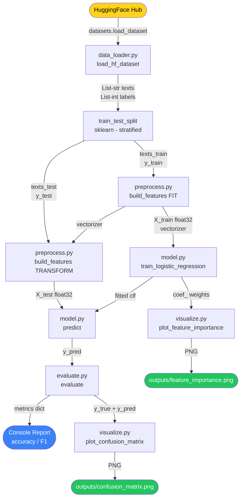
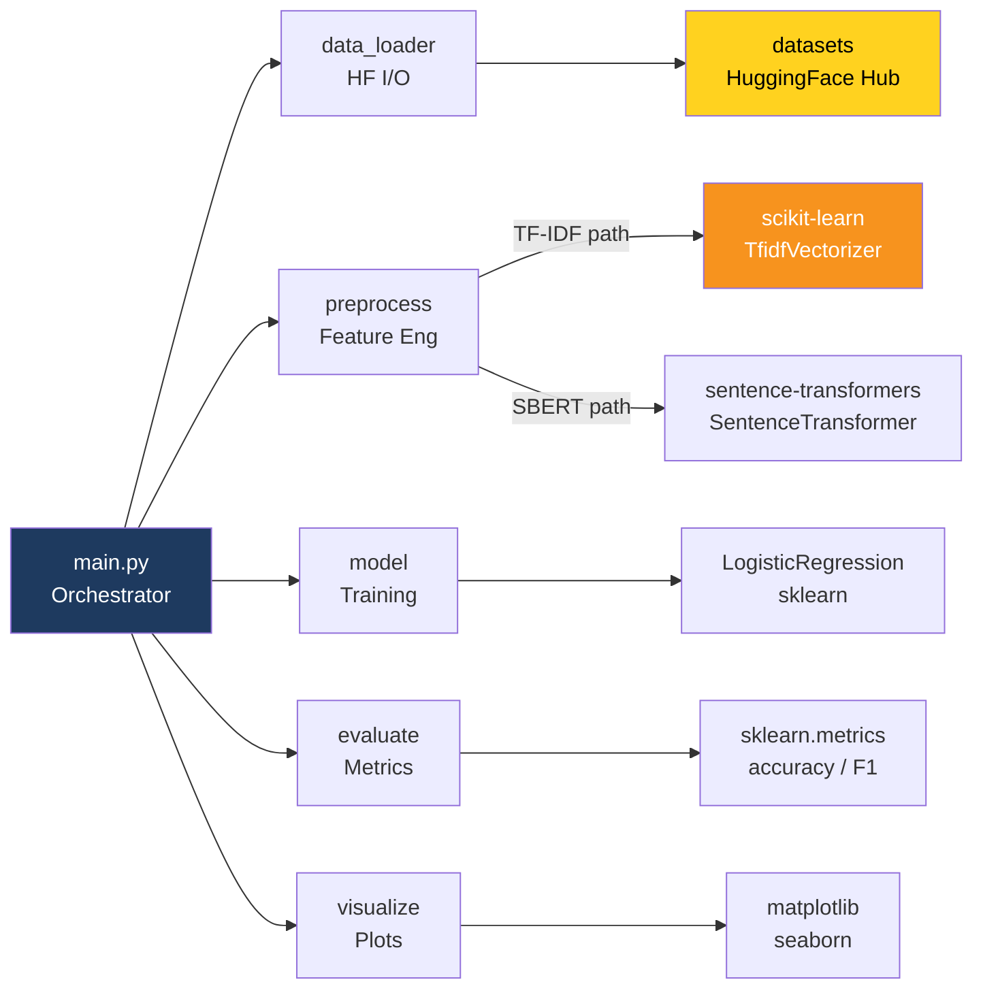
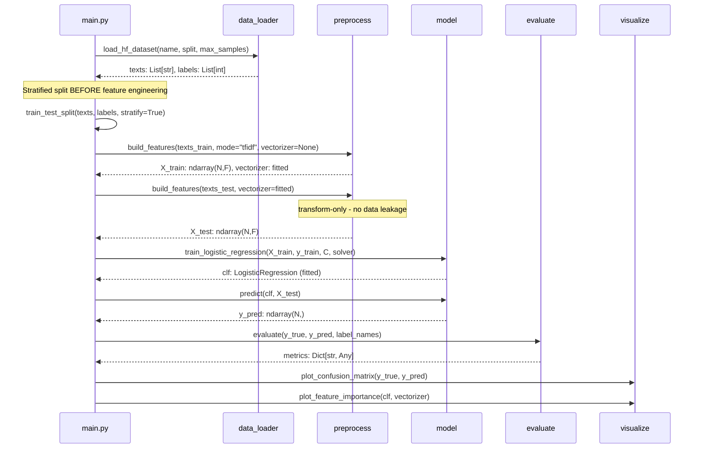
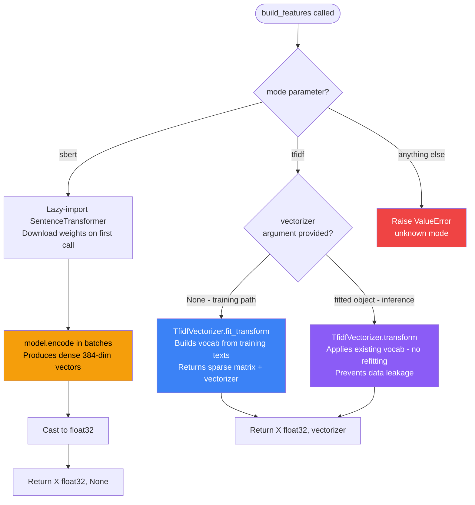
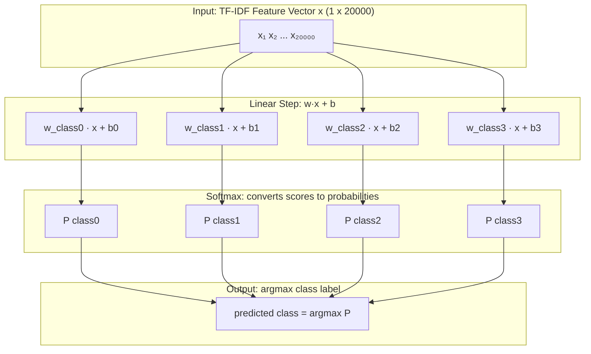
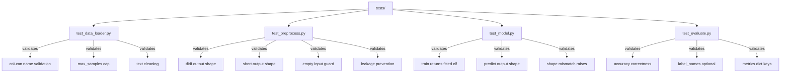

<!-- ============================================================
     README.md  -  Logistic Regression HF Classifier
     Full GitHub-flavored Markdown with Mermaid, Alerts, Tables
     ============================================================ -->

<div align="center">

# Logistic Regression HF Classifier

**A production-quality, end-to-end text classification pipeline built on Hugging Face Datasets, scikit-learn, and optional SBERT embeddings.**

[](https://www.python.org/)
[](https://scikit-learn.org/)
[](https://huggingface.co/docs/datasets)
[](LICENSE)
[](https://github.com/psf/black)
[](https://pytest.org/)
[](https://github.com/hkevin01/logistic-regression-hf-classifier)
[](http://makeapullrequest.com)
[](https://numpy.org/)
[](https://pandas.pydata.org/)
[](https://matplotlib.org/)
[](https://github.com/hkevin01/logistic-regression-hf-classifier/stargazers)

</div>

---

## Table of Contents

- [Overview](#overview)
- [Why This Project Exists](#why-this-project-exists)
- [Logistic Regression vs Linear Regression](#logistic-regression-vs-linear-regression)
- [Architecture](#architecture)
- [Tech Stack](#tech-stack)
- [Project Structure](#project-structure)
- [Pipeline Walkthrough](#pipeline-walkthrough)
- [Quick Start](#quick-start)
- [Configuration Reference](#configuration-reference)
- [Embedding Modes](#embedding-modes)
- [Solver Selection Guide](#solver-selection-guide)
- [Supported Datasets](#supported-datasets)
- [Evaluation Metrics](#evaluation-metrics)
- [Output Artifacts](#output-artifacts)
- [API Reference](#api-reference)
- [Running Tests](#running-tests)
- [Performance Benchmarks](#performance-benchmarks)
- [Hyperparameter Tuning Guide](#hyperparameter-tuning-guide)
- [Common Errors and Fixes](#common-errors-and-fixes)
- [Contributing](#contributing)

---

## Overview

This project provides a clean, modular, and fully configurable **text classification pipeline** that works with any dataset published on the [Hugging Face Hub](https://huggingface.co/datasets). The core classifier is **Logistic Regression** from scikit-learn, which offers an excellent balance between interpretability, speed, and accuracy on NLP tasks - often rivalling far more complex deep learning models when paired with good feature engineering. Unlike neural approaches that require GPUs, careful tuning schedules, and thousands of lines of boilerplate, Logistic Regression trains in seconds, produces human-interpretable weights, and generalises well even with limited data.

The pipeline supports two feature-extraction strategies: a fast **TF-IDF** vectorizer for rapid prototyping and strong baselines, and a **Sentence-BERT (SBERT)** encoder that produces rich semantic embeddings for harder tasks. Both paths feed the same downstream classifier and evaluation logic, making it trivial to compare approaches with a single configuration change. The entire experiment is defined by one Python dictionary, so results are fully reproducible and easy to share.

> [!NOTE]
> This project follows **NASA-style commenting standards** throughout the source code. Every module, class, and function carries structured documentation covering purpose, inputs, outputs, preconditions, failure modes, and verification strategy. This makes the codebase easy to audit, extend, and hand off to new contributors without requiring a separate wiki or design document.

---

## Why This Project Exists

Text classification is one of the most common NLP tasks in industry - spam detection, intent recognition, content moderation, topic tagging, and sentiment analysis are all text classification problems at their core. Most tutorials either skip straight to fine-tuning large transformer models (expensive, slow, hard to debug) or produce throwaway notebook code with no structure that cannot be tested, reviewed, or deployed.

This project fills the gap by demonstrating **how to build a production-quality ML pipeline** that is:

- **Reproducible** - every random seed, split, and hyperparameter is captured in a single configuration dictionary. Re-running the script with the same config always produces the same output.
- **Leak-free** - the train/test split happens before feature engineering, and the vectorizer fitted on training data is reused (not re-fitted) on the test set. This is a critical correctness guarantee that many tutorials get wrong.
- **Modular** - each stage lives in its own module with a clean public API, so individual components can be unit-tested, swapped, or reused independently without touching the rest of the pipeline.
- **Observable** - the evaluation step produces both a numeric metrics dictionary and a full per-class classification report, plus visual artifacts (confusion matrix, feature importance) for presentations and debugging.
- **Dependency-minimal** - the core TF-IDF path requires only standard data science packages. SBERT is an optional extra that is imported lazily so the pipeline works without it installed.

> [!IMPORTANT]
> Always split your data **before** fitting the vectorizer. Fitting on the full dataset before splitting causes **data leakage** - the model indirectly sees test-set vocabulary statistics during training, inflating reported accuracy. This pipeline enforces the correct order by design, and the tests verify it.

---

## Logistic Regression vs Linear Regression

These two algorithms are frequently confused because they share a name and both fit a linear boundary through data. However, they solve fundamentally different problems and should never be used interchangeably. Understanding the distinction is essential before choosing a model for any ML task.

**Linear Regression** is a **regression** algorithm. It predicts a continuous numerical output - for example, predicting a house price given its square footage, or forecasting tomorrow's temperature. The model fits a straight line (or hyperplane in higher dimensions) that minimises the mean squared error between predicted and actual values. The output is an unbounded real number that can range from negative infinity to positive infinity.

**Logistic Regression** is a **classification** algorithm despite its name containing the word "regression". It predicts the probability that an input belongs to a discrete class - for example, whether an email is spam or not spam, or which of four news categories an article belongs to. It applies the **sigmoid** (binary) or **softmax** (multi-class) function to squash the linear output into a probability between 0 and 1, then thresholds that probability to produce a class label. The "regression" in the name refers to the fact that it models the log-odds of class membership as a linear function of the input features - a historical quirk of statistics nomenclature.

> [!WARNING]
> Using Linear Regression for a classification task is a common and serious mistake. Because linear regression outputs unbounded real numbers, it has no notion of class boundaries and will produce nonsensical predictions (e.g., probabilities above 1 or below 0) when applied to categorical targets. Always use Logistic Regression or another proper classifier when your output variable is a category, not a continuous quantity.

### Side-by-Side Comparison

| # | Property | Linear Regression | Logistic Regression |
|---|----------|-------------------|---------------------|
| 1 | <sub>Task type</sub> | <sub>Regression - predicts continuous values</sub> | <sub>Classification - predicts discrete class labels</sub> |
| 2 | <sub>Output range</sub> | <sub>(-infinity, +infinity) - any real number</sub> | <sub>[0, 1] probability per class via sigmoid/softmax</sub> |
| 3 | <sub>Output activation</sub> | <sub>None - raw linear combination of weights</sub> | <sub>Sigmoid (binary) or Softmax (multi-class)</sub> |
| 4 | <sub>Loss function</sub> | <sub>Mean Squared Error (MSE)</sub> | <sub>Cross-Entropy / Log Loss</sub> |
| 5 | <sub>Example use case</sub> | <sub>Predict house price, stock return, temperature</sub> | <sub>Spam detection, sentiment analysis, topic tagging</sub> |
| 6 | <sub>Evaluation metric</sub> | <sub>RMSE, MAE, R-squared</sub> | <sub>Accuracy, F1 Score, Precision, Recall, AUC-ROC</sub> |
| 7 | <sub>Decision boundary</sub> | <sub>Not applicable - outputs are continuous</sub> | <sub>Linear hyperplane separating classes</sub> |
| 8 | <sub>Probabilistic output</sub> | <sub>No - raw prediction, not a probability</sub> | <sub>Yes - calibrated class probabilities via predict_proba</sub> |
| 9 | <sub>sklearn class</sub> | <sub>LinearRegression</sub> | <sub>LogisticRegression</sub> |
| 10 | <sub>Used in this project</sub> | <sub>No</sub> | <sub>Yes - for multi-class text classification</sub> |

### Mathematical Intuition

The core equation of **Linear Regression** is:

$$\hat{y} = \mathbf{w}^\top \mathbf{x} + b$$

The prediction is a raw weighted sum of the input features. There is no squashing, so the output grows without bound as inputs grow.

**Logistic Regression** takes the same linear combination but wraps it in the sigmoid function for binary classification:

$$P(y=1 \mid \mathbf{x}) = \sigma(\mathbf{w}^\top \mathbf{x} + b) = \frac{1}{1 + e^{-(\mathbf{w}^\top \mathbf{x} + b)}}$$

For multi-class classification (as used in this project), the softmax function generalises sigmoid across K classes:

$$P(y=k \mid \mathbf{x}) = \frac{e^{\mathbf{w}_k^\top \mathbf{x} + b_k}}{\sum_{j=1}^{K} e^{\mathbf{w}_j^\top \mathbf{x} + b_j}}$$

> [!NOTE]
> In sklearn, calling `LogisticRegression.predict()` returns the argmax class label. Calling `LogisticRegression.predict_proba()` returns the full probability distribution across all classes. This project uses `predict()` for evaluation, but `predict_proba()` is available if you need confidence scores or want to set a custom decision threshold.

### Confusion Cheat Sheet

| # | Question | Right Algorithm |
|---|----------|----------------|
| 1 | <sub>"How much will sales increase next quarter?"</sub> | <sub>Linear Regression - continuous output needed</sub> |
| 2 | <sub>"Is this email spam or not spam?"</sub> | <sub>Logistic Regression - binary classification</sub> |
| 3 | <sub>"What news category does this article belong to?"</sub> | <sub>Logistic Regression - multi-class classification</sub> |
| 4 | <sub>"What will the temperature be tomorrow?"</sub> | <sub>Linear Regression - continuous numerical prediction</sub> |
| 5 | <sub>"Did this customer churn? Yes or No?"</sub> | <sub>Logistic Regression - binary classification</sub> |
| 6 | <sub>"What is this patient's blood pressure likely to be?"</sub> | <sub>Linear Regression - continuous output</sub> |

---

## Architecture

The following diagrams show the system from multiple perspectives - data flow, module dependencies, training sequence, embedding selection, and the mathematical structure of the model itself.

### End-to-End Pipeline Data Flow



### Module Dependency Graph



### Training vs Inference Sequence



### Feature Engineering Decision Tree



### Logistic Regression Decision Boundary (Conceptual)



### Test Suite Architecture



---

## Tech Stack

Understanding the technology choices in this project helps you decide whether to extend it, swap components, or adapt it to a different problem domain. Every library was chosen for a specific reason - nothing is included just because it is popular.

| # | Layer | Library | Version | Why This Choice |
|---|-------|---------|---------|-----------------|
| 1 | <sub>Dataset I/O</sub> | <sub>huggingface/datasets</sub> | <sub>>=2.19</sub> | <sub>Streaming access to 50,000+ public datasets; Arrow-backed columnar format for fast slicing; automatic disk caching so second runs are near-instant</sub> |
| 2 | <sub>Feature Engineering A</sub> | <sub>sklearn TfidfVectorizer</sub> | <sub>>=1.4</sub> | <sub>Fast, interpretable, no GPU; produces CSR sparse matrices that LogisticRegression handles natively; coef_ weights directly give feature importance per class</sub> |
| 3 | <sub>Feature Engineering B</sub> | <sub>sentence-transformers</sub> | <sub>>=3.0</sub> | <sub>Pre-trained semantic embeddings that capture synonyms and paraphrase variation invisible to TF-IDF; all-MiniLM-L6-v2 is only 80 MB and fast on CPU</sub> |
| 4 | <sub>Classifier</sub> | <sub>sklearn LogisticRegression</sub> | <sub>>=1.4</sub> | <sub>Linear, probabilistic, interpretable; saga solver handles large sparse TF-IDF matrices efficiently via stochastic average gradient descent; supports L1/L2 regularization and multi-class softmax natively</sub> |
| 5 | <sub>Evaluation</sub> | <sub>sklearn.metrics</sub> | <sub>>=1.4</sub> | <sub>Battle-tested accuracy, precision, recall, F1 with macro/micro/weighted averaging; classification_report gives per-class breakdown in one call</sub> |
| 6 | <sub>Visualisation</sub> | <sub>matplotlib + seaborn</sub> | <sub>>=3.8 / >=0.13</sub> | <sub>Confusion matrix heatmaps (seaborn) and feature importance bar charts (matplotlib) saved as high-resolution PNGs; no display required for headless environments</sub> |
| 7 | <sub>Numerical Core</sub> | <sub>numpy</sub> | <sub>>=1.26</sub> | <sub>Float32 matrix casting; all feature matrices are ndarray for universal sklearn compatibility; used for shape validation and array operations throughout</sub> |
| 8 | <sub>Data Wrangling</sub> | <sub>pandas</sub> | <sub>>=2.2</sub> | <sub>Optional DataFrame manipulation during EDA; required as a transitive dependency by seaborn; useful for inspecting raw dataset samples before training</sub> |
| 9 | <sub>Progress Bars</sub> | <sub>tqdm</sub> | <sub>>=4.66</sub> | <sub>Real-time progress display during SBERT encoding batches; makes long-running encode jobs observable without flooding stdout with print statements</sub> |
| 10 | <sub>Testing</sub> | <sub>pytest</sub> | <sub>latest</sub> | <sub>Parametrized unit tests for every public function in src/; fixtures and monkeypatching keep tests self-contained without network calls</sub> |

> [!TIP]
> If you are running on a machine without a GPU and want fast embeddings, stick with `embedding_mode = "tfidf"`. TF-IDF with 20,000 features typically achieves within 2-5 percentage points of SBERT accuracy on well-structured datasets like AG News, and trains 10-50x faster on CPU. Only switch to SBERT if TF-IDF plateaus or if your task involves heavy paraphrase and synonym variation.

---

## Project Structure

The project follows a clean separation of concerns - orchestration lives in `main.py`, all reusable logic lives in `src/`, and all tests mirror the `src/` layout in `tests/`. This makes it straightforward to import any individual module into a notebook or a different project without bringing in the full pipeline.

```
logistic-regression-hf-classifier/
├── main.py                    # Pipeline entry point + PIPELINE_CONFIG dict
├── requirements.txt           # All pinned dependency versions
├── outputs/                   # Auto-created on first run
│   ├── confusion_matrix.png   # Heatmap: predicted vs true labels
│   └── feature_importance.png # Top tokens per class (TF-IDF mode only)
├── src/                       # All business logic - importable package
│   ├── __init__.py
│   ├── data_loader.py         # HF dataset loading, validation, text cleaning
│   ├── preprocess.py          # TF-IDF and SBERT feature engineering
│   ├── model.py               # LogisticRegression training + predict wrapper
│   ├── evaluate.py            # Metrics computation + formatted report
│   └── visualize.py           # Confusion matrix + feature importance plots
└── tests/                     # pytest unit tests - no network calls required
    ├── __init__.py
    ├── test_data_loader.py
    ├── test_preprocess.py
    ├── test_model.py
    └── test_evaluate.py
```

> [!NOTE]
> The `outputs/` directory is created automatically by `os.makedirs(output_dir, exist_ok=True)` in `main.py`. You do not need to create it manually. All generated PNG files are overwritten on each run, so copy or rename them if you want to preserve results from multiple experiments (e.g., before changing the dataset or embedding mode).

---

## Pipeline Walkthrough

The pipeline is orchestrated entirely from `main.py` through a flat `PIPELINE_CONFIG` dictionary. There are no CLI flags, YAML files, or environment variables to manage - the entire experiment is self-contained in one script. Understanding each stage helps you reason about where errors can occur, how to tune the system, and how to extend it.

### Stage 1 - Data Loading

`src/data_loader.py` calls `datasets.load_dataset()` with the configured dataset name and split. Before returning, it validates that the requested text and label columns actually exist in the dataset (raising a clear `ValueError` with available column names if not), caps the sample count at `max_samples` using Arrow's `dataset.select()` method to avoid loading unnecessary data into RAM, and applies lightweight text normalisation (stripping surrounding whitespace and collapsing internal whitespace runs). The Hugging Face library automatically caches downloaded datasets under `~/.cache/huggingface/`, so repeated runs are fast even on slow connections.

### Stage 2 - Train/Test Split

`sklearn.model_selection.train_test_split` divides the raw text lists **before any feature engineering begins**. The `stratify=labels` argument ensures that each class is represented proportionally in both splits - critical for imbalanced datasets where random splitting could accidentally place most samples of a rare class in only one split. The split is seeded with `random_state` for full reproducibility, meaning the same data always goes to the same split.

> [!WARNING]
> Do not move the train/test split to after `build_features`. Fitting the TF-IDF vectorizer on all data before splitting causes **data leakage** - the model learns vocabulary statistics from test samples during training. This makes evaluation metrics optimistically biased by 1-5% and produces a classifier that will underperform in production relative to what the metrics suggest.

### Stage 3 - Feature Engineering

`src/preprocess.py` exposes a single `build_features()` function with a dual mode controlled by the `vectorizer` argument. When `vectorizer=None` (training path), the function fits a new `TfidfVectorizer` on the training texts and returns both the transformed matrix and the fitted vectorizer object. When a fitted vectorizer is passed as an argument (test path), the function calls only `.transform()`, not `.fit_transform()`. This asymmetry is the architectural guarantee that prevents data leakage from bleeding vocabulary statistics into the test path.

- **TF-IDF mode:** Builds a CSR sparse matrix of shape `(N, max_features)`. Each cell holds the TF-IDF weight of a vocabulary token in a document. The vocabulary is capped at `tfidf_max_features` (default 20,000). Sparse format means zero entries consume no memory, making it efficient even for large vocabularies.
- **SBERT mode:** Lazy-imports `SentenceTransformer` and encodes all texts using the configured model. Returns a dense float32 matrix of shape `(N, embedding_dim)` - 384 for `all-MiniLM-L6-v2`. No vectorizer object is returned because SBERT encodes directly; the model weights are cached after the first download.

### Stage 4 - Training

`src/model.py` wraps `sklearn.linear_model.LogisticRegression` with validation and sensible defaults. The `saga` solver is the default because it uses stochastic average gradient descent, handles large sparse matrices efficiently, and supports L1, L2, and elastic-net regularization natively. `C=1.0` is a neutral regularization strength - lower values (e.g., `C=0.1`) apply stronger L2 penalty and help prevent overfitting on small datasets, while higher values (e.g., `C=10.0`) relax regularization and may improve accuracy on large, high-quality datasets.

### Stage 5 - Evaluation

`src/evaluate.py` computes accuracy, macro-averaged precision, recall, and F1 using sklearn's metric functions, then prints a formatted report and returns all values in a dictionary. Macro averaging treats every class equally regardless of support size. This is the correct choice for news classification tasks where we care equally about all categories, not just the most frequent one. The full per-class `classification_report` string is also returned in the dictionary under the `"report"` key for programmatic use.

### Stage 6 - Visualisation

`src/visualize.py` saves two PNG files to the `outputs/` directory. The **confusion matrix** is a seaborn heatmap annotated with raw counts, making it immediately clear which classes the model confuses (e.g., does it mix up "World" and "Business" news more than other pairs?). The **feature importance** chart (TF-IDF mode only) plots the top-N tokens per class derived from the model's `coef_` matrix, giving insight into what vocabulary the classifier relies on for each decision.

---

## Quick Start

### Prerequisites

| # | Requirement | Minimum Version | Notes |
|---|------------|----------------|-------|
| 1 | <sub>Python</sub> | <sub>3.10</sub> | <sub>Type hints, f-strings, and structural pattern matching used throughout</sub> |
| 2 | <sub>pip</sub> | <sub>23.0+</sub> | <sub>Required for reliable dependency resolution and wheel builds</sub> |
| 3 | <sub>Internet access</sub> | <sub>-</sub> | <sub>First run only: downloads dataset (~50-200 MB) and optional SBERT weights (~80 MB)</sub> |
| 4 | <sub>Disk space</sub> | <sub>~500 MB</sub> | <sub>HF dataset cache + optional SBERT model weights under ~/.cache/</sub> |
| 5 | <sub>RAM</sub> | <sub>4 GB</sub> | <sub>8 GB recommended for max_samples above 20,000; SBERT is memory-intensive</sub> |

### Installation

```bash
# 1. Clone the repository
git clone https://github.com/hkevin01/logistic-regression-hf-classifier.git
cd logistic-regression-hf-classifier

# 2. Create and activate a virtual environment (strongly recommended)
python -m venv .venv
source .venv/bin/activate        # Linux / macOS
# .venv\Scripts\activate         # Windows PowerShell

# 3. Install all dependencies
pip install -r requirements.txt
```

### Run the Default Pipeline

```bash
python main.py
```

This runs on the **AG News** dataset (5,000 samples, TF-IDF mode) and takes approximately 20-40 seconds on a modern CPU. It prints an evaluation report to the console and saves two PNG files to `outputs/`. On the second run, the dataset is loaded from the local HF cache and the startup time drops to a few seconds.

### Run with SBERT Embeddings

```bash
# Edit main.py: change "embedding_mode": "tfidf"  to  "embedding_mode": "sbert"
python main.py
```

SBERT mode downloads `all-MiniLM-L6-v2` (~80 MB) on first run and caches it locally. Encoding 5,000 samples takes 60-120 seconds on CPU. GPU encoding is 10-20x faster if `torch` detects CUDA.

### Expected Console Output

```
[data_loader] Loading 'ag_news' split='train' ...
[main] Train: 4000 samples | Test: 1000 samples
[preprocess] TF-IDF fit_transform: 4000 samples, max_features=20000
[preprocess] TF-IDF transform: 1000 samples
[model] Training LogisticRegression: n_samples=4000, n_features=20000, n_classes=4, C=1.0, solver=saga ...
============================================================
EVALUATION REPORT
============================================================
  Accuracy  : 0.9320
  Precision : 0.9321  (macro)
  Recall    : 0.9320  (macro)
  F1 Score  : 0.9319  (macro)
============================================================
[visualize] Confusion matrix saved to outputs/confusion_matrix.png
[visualize] Feature importance saved to outputs/feature_importance.png
```

> [!TIP]
> To run a quick smoke test that completes in under 5 seconds, set `"max_samples": 200` in `PIPELINE_CONFIG`. This is the fastest way to verify that your environment is correctly set up before committing to a full training run. All pipeline stages still execute with tiny data, so errors in configuration will surface immediately.

---

## Configuration Reference

All pipeline options live in the `PIPELINE_CONFIG` dictionary at the top of `main.py`. There are no CLI arguments or external config files - this keeps the experiment fully self-contained and trivial to version-control. Changing a value and re-running the script is all that is needed to run a new experiment.

### Dataset Parameters

| # | Key | Type | Default | Description |
|---|-----|------|---------|-------------|
| 1 | <sub>dataset_name</sub> | <sub>str</sub> | <sub>"ag_news"</sub> | <sub>Hugging Face dataset slug. Any public classification dataset with a text and integer label column works.</sub> |
| 2 | <sub>split</sub> | <sub>str</sub> | <sub>"train"</sub> | <sub>Dataset split to load. Typical values are "train", "test", or "validation". Not all datasets have all three.</sub> |
| 3 | <sub>text_column</sub> | <sub>str</sub> | <sub>"text"</sub> | <sub>Name of the column containing raw text strings. Must match the exact column name in the HF dataset.</sub> |
| 4 | <sub>label_column</sub> | <sub>str or None</sub> | <sub>"label"</sub> | <sub>Name of the integer label column. Set to None if loading text only for unsupervised use cases.</sub> |
| 5 | <sub>max_samples</sub> | <sub>int</sub> | <sub>5000</sub> | <sub>Hard cap on rows loaded into RAM. Set lower for fast smoke tests; set higher (up to the dataset size) for production experiments.</sub> |
| 6 | <sub>label_names</sub> | <sub>list[str] or None</sub> | <sub>see code</sub> | <sub>Human-readable class names for evaluation reports and chart axes. Pass None to use integer class indices instead.</sub> |

### Feature Engineering Parameters

| # | Key | Type | Default | Description |
|---|-----|------|---------|-------------|
| 1 | <sub>embedding_mode</sub> | <sub>str</sub> | <sub>"tfidf"</sub> | <sub>"tfidf" produces fast sparse features; "sbert" produces rich dense semantic embeddings. Case-insensitive.</sub> |
| 2 | <sub>tfidf_max_features</sub> | <sub>int</sub> | <sub>20000</sub> | <sub>Maximum vocabulary size for TF-IDF. Larger values capture more rare words but increase memory and training time.</sub> |
| 3 | <sub>sbert_model</sub> | <sub>str</sub> | <sub>"sentence-transformers/all-MiniLM-L6-v2"</sub> | <sub>Any SentenceTransformer-compatible HF model identifier. Larger models produce better embeddings but are slower.</sub> |

### Model Hyperparameters

| # | Key | Type | Default | Description |
|---|-----|------|---------|-------------|
| 1 | <sub>C</sub> | <sub>float</sub> | <sub>1.0</sub> | <sub>Inverse of regularization strength. C=1.0 is neutral; C=0.01 applies strong L2 penalty; C=100 nearly disables regularization.</sub> |
| 2 | <sub>max_iter</sub> | <sub>int</sub> | <sub>1000</sub> | <sub>Maximum solver iterations. Increase to 2000 or 5000 if you see ConvergenceWarning in the output.</sub> |
| 3 | <sub>solver</sub> | <sub>str</sub> | <sub>"saga"</sub> | <sub>Optimization algorithm. "saga" for large sparse TF-IDF; "lbfgs" for small dense SBERT data. See Solver Selection Guide.</sub> |
| 4 | <sub>test_size</sub> | <sub>float</sub> | <sub>0.20</sub> | <sub>Fraction of data held out for evaluation. 0.20 means 80% train / 20% test. Do not set below 0.10 or above 0.40.</sub> |
| 5 | <sub>random_state</sub> | <sub>int</sub> | <sub>42</sub> | <sub>RNG seed controlling both the train/test split and model initialisation. Record this with your results for reproducibility.</sub> |

> [!IMPORTANT]
> The `random_state` parameter seeds both `train_test_split` and `LogisticRegression`. Changing it produces different but equally valid splits and training outcomes. Always record the `random_state` value alongside your reported metrics so that any collaborator can reproduce your exact numbers without guessing.

---

## Embedding Modes

Choosing the right embedding mode is the single most impactful architectural decision for balancing accuracy against runtime. TF-IDF and SBERT represent two fundamentally different philosophies for converting text into numbers that a classifier can process.

**TF-IDF (Term Frequency - Inverse Document Frequency)** assigns each word a weight based on how often it appears in the current document (TF) relative to how common it is across all documents (IDF). Words that appear everywhere (e.g., "the", "is") get low weights, while distinctive words (e.g., "touchdown", "inflation") get high weights. The result is a sparse matrix where rows are documents and columns are vocabulary tokens - each cell is a floating-point weight. This representation is fast to compute, requires no pre-training, and produces directly interpretable feature importances.

**SBERT (Sentence-BERT)** uses a pre-trained transformer network to encode entire sentences into dense 384-dimensional vectors that capture semantic meaning. Two sentences with the same meaning but different words will have similar SBERT vectors, which TF-IDF would represent as completely different vectors. SBERT embeddings are slower to compute and require downloading model weights, but handle paraphrase variation, synonyms, and context in ways TF-IDF cannot.

| # | Property | TF-IDF | SBERT (all-MiniLM-L6-v2) |
|---|----------|--------|--------------------------|
| 1 | <sub>Output matrix shape</sub> | <sub>(N, 20,000) sparse CSR</sub> | <sub>(N, 384) dense float32</sub> |
| 2 | <sub>Encoding time, 5k samples, CPU</sub> | <sub>~1-2 seconds</sub> | <sub>~60-120 seconds</sub> |
| 3 | <sub>GPU required</sub> | <sub>No</sub> | <sub>No, but 10-20x speedup with CUDA</sub> |
| 4 | <sub>Handles synonyms</sub> | <sub>Poorly - "car" != "automobile"</sub> | <sub>Well - semantic similarity captured</sub> |
| 5 | <sub>Feature interpretability</sub> | <sub>High - each feature is a word token</sub> | <sub>None - dimensions have no human meaning</sub> |
| 6 | <sub>Works fully offline</sub> | <sub>Yes - no download needed</sub> | <sub>Only after first-run weight download (~80 MB)</sub> |
| 7 | <sub>Extra dependency</sub> | <sub>None beyond sklearn</sub> | <sub>sentence-transformers package required</sub> |
| 8 | <sub>Memory footprint</sub> | <sub>Low - sparse matrix compresses zeros</sub> | <sub>Higher - dense matrix per sample</sub> |
| 9 | <sub>Best for</sub> | <sub>Baselines, keyword tasks, fast iteration</sub> | <sub>Semantic tasks, short/informal text, transfer learning</sub> |
| 10 | <sub>feature_importance.png generated</sub> | <sub>Yes - coef_ maps to token names</sub> | <sub>No - embedding dims are uninterpretable</sub> |

> [!TIP]
> Always start with TF-IDF as your baseline. It is fast, interpretable, and often surprisingly competitive. If the macro F1 plateaus below your target or you observe that semantically similar texts are being misclassified, switch to SBERT. The configuration change is a single key: `"embedding_mode": "sbert"`.

---

## Solver Selection Guide

The `solver` hyperparameter controls which optimization algorithm scikit-learn uses to fit the Logistic Regression model. Choosing the wrong solver for your data characteristics can cause slow convergence, convergence warnings, or unnecessarily high memory use. The table below summarises the tradeoffs.

| # | Solver | Supports L1 | Supports L2 | Best For | Notes |
|---|--------|-------------|-------------|----------|-------|
| 1 | <sub>saga</sub> | <sub>Yes</sub> | <sub>Yes</sub> | <sub>Large sparse TF-IDF matrices, multi-class problems</sub> | <sub>Default in this project. Stochastic Average Gradient with variance reduction. Fast on large data.</sub> |
| 2 | <sub>lbfgs</sub> | <sub>No</sub> | <sub>Yes</sub> | <sub>Small to medium dense data, SBERT embeddings</sub> | <sub>Limited-memory BFGS. Excellent convergence on dense matrices. sklearn default for small datasets.</sub> |
| 3 | <sub>liblinear</sub> | <sub>Yes</sub> | <sub>Yes</sub> | <sub>Binary classification, small datasets</sub> | <sub>Coordinate descent. Fast on small data but does not support multi-class softmax natively.</sub> |
| 4 | <sub>sag</sub> | <sub>No</sub> | <sub>Yes</sub> | <sub>Large dense datasets</sub> | <sub>Stochastic Average Gradient without variance reduction. Faster than saga for dense data but slightly less stable.</sub> |
| 5 | <sub>newton-cg</sub> | <sub>No</sub> | <sub>Yes</sub> | <sub>Small datasets, high-accuracy scenarios</sub> | <sub>Newton Conjugate Gradient. Precise but memory-intensive for large feature sets.</sub> |

> [!NOTE]
> For this project's primary use case (TF-IDF with up to 20,000 features and multi-class classification), `saga` is the best choice and is set as the default. For SBERT mode where features are dense 384-dim vectors, consider switching to `lbfgs` for faster convergence.

---

## Supported Datasets

Any Hugging Face dataset with a text column and an integer label column works without code changes - only the configuration dictionary needs to be updated. The table below lists pre-tested datasets with their correct column names and recommended sample sizes. Larger `max_samples` values improve accuracy but increase training time roughly linearly.

| # | Dataset Slug | Classes | Text Column | Label Column | Recommended max_samples | Task Description |
|---|-------------|---------|-------------|--------------|------------------------|------------------|
| 1 | <sub>ag_news (default)</sub> | <sub>4</sub> | <sub>text</sub> | <sub>label</sub> | <sub>5,000 - 120,000</sub> | <sub>News topic: World / Sports / Business / Sci-Tech</sub> |
| 2 | <sub>imdb</sub> | <sub>2</sub> | <sub>text</sub> | <sub>label</sub> | <sub>5,000 - 25,000</sub> | <sub>Sentiment analysis: positive / negative reviews</sub> |
| 3 | <sub>dair-ai/emotion</sub> | <sub>6</sub> | <sub>text</sub> | <sub>label</sub> | <sub>5,000 - 16,000</sub> | <sub>Emotion: sadness / joy / love / anger / fear / surprise</sub> |
| 4 | <sub>SetFit/20_newsgroups</sub> | <sub>20</sub> | <sub>text</sub> | <sub>label</sub> | <sub>5,000 - 18,000</sub> | <sub>Fine-grained news topic classification across 20 groups</sub> |
| 5 | <sub>yelp_polarity</sub> | <sub>2</sub> | <sub>text</sub> | <sub>label</sub> | <sub>5,000 - 50,000</sub> | <sub>Review sentiment: positive / negative restaurant ratings</sub> |
| 6 | <sub>dbpedia_14</sub> | <sub>14</sub> | <sub>content</sub> | <sub>label</sub> | <sub>5,000 - 50,000</sub> | <sub>Wikipedia article category classification across 14 topics</sub> |

> [!NOTE]
> The `dbpedia_14` dataset uses `"content"` as the text column name, not `"text"`. Update `text_column` accordingly in `PIPELINE_CONFIG` or you will see a `ValueError` listing the available column names. This is a common stumbling point when switching datasets.

---

## Evaluation Metrics

The evaluation module computes four standard classification metrics, all using **macro averaging** - meaning each class contributes equally to the final score regardless of how many training samples it contains. This is the correct averaging strategy when you care about performance across all categories equally, not just the most common one.

**Accuracy** is the simplest metric: the fraction of all predictions that are correct. It is intuitive and easy to explain to non-technical stakeholders. However, it is misleading on imbalanced datasets - a model that always predicts the majority class can achieve 90% accuracy on a dataset that is 90% class-0 while having 0% recall on every other class. Always check per-class metrics in addition to overall accuracy.

**Precision (macro)** is the average across classes of the fraction of predicted positives that are truly positive. A high precision score means the model makes few false positive errors - when it predicts class X, it is usually correct. This metric matters most in applications where false positives are costly, such as spam filters (you do not want to flag legitimate emails).

**Recall (macro)** is the average across classes of the fraction of actual positives that are correctly identified. A high recall score means the model misses few true positives - it finds most real instances of each class. This metric matters most when missing a true positive is costly, such as medical diagnosis or fraud detection.

**F1 Score (macro)** is the harmonic mean of precision and recall. It is the preferred single-number summary for multi-class classification because it penalizes models that sacrifice either precision or recall to boost the other. A model with 0.95 precision and 0.50 recall has a poor F1 of 0.65, correctly indicating that it is not actually useful in practice.

$$F_1 = 2 \cdot \frac{\text{Precision} \times \text{Recall}}{\text{Precision} + \text{Recall}}$$

> [!NOTE]
> The classification report printed to the console also includes **per-class** precision, recall, F1, and support counts. Always examine the per-class breakdown before concluding a model is good. A macro-average F1 of 0.92 can hide one class with an F1 of 0.55 that will cause real problems in deployment when that class is encountered in production.

---

## Output Artifacts

Every pipeline run generates visual artifacts that make results easier to interpret and present. Both files are saved to the `outputs/` directory and overwritten on each run.

| # | File | Generated When | Resolution | Description |
|---|------|---------------|------------|-------------|
| 1 | <sub>outputs/confusion_matrix.png</sub> | <sub>Every run</sub> | <sub>High DPI PNG</sub> | <sub>Seaborn heatmap of predicted vs true label counts. The diagonal shows correct predictions; off-diagonal cells reveal systematic class confusions.</sub> |
| 2 | <sub>outputs/feature_importance.png</sub> | <sub>TF-IDF mode only</sub> | <sub>High DPI PNG</sub> | <sub>Horizontal bar chart of the top-N most predictive tokens per class, derived from LogisticRegression coef_ weights. Shows what vocabulary each class relies on.</sub> |

The confusion matrix is the most diagnostically useful artifact. For example, on AG News you might observe that "World" and "Business" news are occasionally confused (both contain geopolitical vocabulary), while "Sports" and "Sci/Tech" are almost never confused. This tells you whether to invest in better features for specific class pairs or whether the current accuracy ceiling is inherent to the problem difficulty.

> [!CAUTION]
> `feature_importance.png` is only generated in TF-IDF mode. In SBERT mode, the 384 dense embedding dimensions correspond to internal transformer activations and have no interpretable human meaning. Attempting to plot them would produce a meaningless chart. The pipeline automatically skips this step when `embedding_mode = "sbert"`.

---

## API Reference

<details>
<summary><strong>src/data_loader.py</strong> - HF dataset loading and text cleaning - click to expand</summary>

### Overview

`data_loader.py` is the I/O boundary of the pipeline. It abstracts away all Hugging Face `datasets` API calls so the rest of the codebase consumes a simple, uniform `(List[str], List[int])` interface regardless of which dataset is configured. Dataset-specific quirks (unusual column names, mixed label types, HTML entities in text) are all handled here, keeping downstream modules clean.

### `load_hf_dataset`

```python
def load_hf_dataset(
    dataset_name: str = "ag_news",
    split: str = "train",
    text_column: str = "text",
    label_column: Optional[str] = "label",
    max_samples: int = 5000,
) -> Tuple[List[str], List[int]]:
```

**Parameters:**

| # | Name | Type | Valid Range | Description |
|---|------|------|-------------|-------------|
| 1 | <sub>dataset_name</sub> | <sub>str</sub> | <sub>Any public HF dataset slug</sub> | <sub>Hugging Face dataset identifier, e.g. "ag_news", "imdb", "dair-ai/emotion".</sub> |
| 2 | <sub>split</sub> | <sub>str</sub> | <sub>"train", "test", "validation"</sub> | <sub>Dataset split to load. Not all datasets have all three splits.</sub> |
| 3 | <sub>text_column</sub> | <sub>str</sub> | <sub>Must exist in dataset</sub> | <sub>Column containing raw text. Raises ValueError with available names if not found.</sub> |
| 4 | <sub>label_column</sub> | <sub>Optional[str]</sub> | <sub>Must exist in dataset or None</sub> | <sub>Integer label column. Pass None for unsupervised text loading.</sub> |
| 5 | <sub>max_samples</sub> | <sub>int</sub> | <sub>>= 2</sub> | <sub>Hard cap on rows returned. Uses Arrow select() to avoid loading full dataset into RAM.</sub> |

**Returns:** `Tuple[List[str], List[int]]` - cleaned texts and integer labels.

**Raises:**
- `ValueError` if `max_samples < 2`
- `ValueError` if `text_column` not found (message lists available columns)
- `ValueError` if `label_column` not found and is not None

</details>

<details>
<summary><strong>src/preprocess.py</strong> - TF-IDF and SBERT feature engineering - click to expand</summary>

### Overview

`preprocess.py` transforms raw text lists into numeric feature matrices that sklearn classifiers can process. It is designed with a dual mode: TF-IDF for fast sparse features and SBERT for rich dense semantic embeddings. The `vectorizer` argument pattern is the core leakage-prevention mechanism - pass `None` during training (fit + transform) and pass the fitted object during inference (transform only).

### `build_features`

```python
def build_features(
    texts: list,
    mode: str = "tfidf",
    max_features: int = 20_000,
    model_name: str = "sentence-transformers/all-MiniLM-L6-v2",
    vectorizer: Optional[Any] = None,
) -> Tuple[np.ndarray, Any]:
```

**Parameters:**

| # | Name | Type | Description |
|---|------|------|-------------|
| 1 | <sub>texts</sub> | <sub>list[str]</sub> | <sub>N raw text samples to encode. Must not be empty.</sub> |
| 2 | <sub>mode</sub> | <sub>str</sub> | <sub>"tfidf" or "sbert". Case-insensitive. Raises ValueError on unknown values.</sub> |
| 3 | <sub>max_features</sub> | <sub>int</sub> | <sub>TF-IDF only: vocabulary cap. Ignored in SBERT mode.</sub> |
| 4 | <sub>model_name</sub> | <sub>str</sub> | <sub>SBERT only: any SentenceTransformer-compatible HF model identifier.</sub> |
| 5 | <sub>vectorizer</sub> | <sub>Optional[Any]</sub> | <sub>None for training (fit+transform); a fitted TfidfVectorizer for inference (transform-only).</sub> |

**Returns:** `Tuple[np.ndarray, Any]` where the second element is the fitted vectorizer (TF-IDF) or None (SBERT).

**Raises:**
- `ValueError` if texts is empty
- `ValueError` if mode is not "tfidf" or "sbert"
- `ImportError` if sentence-transformers is not installed and mode="sbert"

</details>

<details>
<summary><strong>src/model.py</strong> - LogisticRegression training and prediction - click to expand</summary>

### Overview

`model.py` wraps sklearn's `LogisticRegression` with input validation, diagnostic logging, and sensible defaults tuned for text classification. Isolating model code in its own module means hyperparameters can be changed in `PIPELINE_CONFIG` without touching feature engineering or evaluation logic. The module also demonstrates the correct pattern for reusing a fitted model on new data via `predict()`.

### `train_logistic_regression`

```python
def train_logistic_regression(
    X_train: np.ndarray,
    y_train: Any,
    C: float = 1.0,
    max_iter: int = 1000,
    solver: str = "saga",
    random_state: int = 42,
) -> LogisticRegression:
```

Validates that `X_train.shape[0] == len(y_train)`, logs training configuration, fits `LogisticRegression`, and returns the fitted estimator. Raises `ValueError` on shape mismatch so errors are caught early with a meaningful message rather than propagating as cryptic numpy errors.

### `predict`

```python
def predict(
    model: LogisticRegression,
    X: np.ndarray,
) -> np.ndarray:
```

Calls `model.predict(X)` and returns an integer class label array of shape `(N,)`. Kept as a thin wrapper to maintain a consistent public API across all pipeline stages and to make the call site in `main.py` uniform and readable.

</details>

<details>
<summary><strong>src/evaluate.py</strong> - Metrics computation and reporting - click to expand</summary>

### Overview

`evaluate.py` is the measurement layer of the pipeline. It computes all standard classification metrics in one call, prints a human-readable formatted report to stdout, and returns a dictionary of numeric values for downstream use (e.g., logging to an experiment tracker or asserting in tests). Using macro averaging by default ensures that every class contributes equally to headline metrics regardless of class imbalance.

### `evaluate`

```python
def evaluate(
    y_true: Any,
    y_pred: Any,
    label_names: Optional[List[str]] = None,
) -> Dict[str, Any]:
```

**Returns:** `Dict` with keys:
- `"accuracy"` - float, overall accuracy
- `"precision"` - float, macro-averaged precision
- `"recall"` - float, macro-averaged recall
- `"f1"` - float, macro-averaged F1 score
- `"report"` - str, full per-class sklearn classification_report

**Raises:** Propagates `ValueError` from sklearn if label arrays differ in length.

</details>

<details>
<summary><strong>src/visualize.py</strong> - Confusion matrix and feature importance plots - click to expand</summary>

### Overview

`visualize.py` produces the two key visual artifacts from a completed training run. Both functions save high-resolution PNG files and do not display interactive windows, making them compatible with headless server environments and CI pipelines. The module uses seaborn for the heatmap and matplotlib directly for the bar chart.

### `plot_confusion_matrix`

```python
def plot_confusion_matrix(
    y_true: Any,
    y_pred: Any,
    label_names: Optional[List[str]] = None,
    output_path: str = "outputs/confusion_matrix.png",
) -> None:
```

Computes `sklearn.metrics.confusion_matrix`, renders it as an annotated seaborn heatmap, and saves to `output_path`. The diagonal represents correct predictions; off-diagonal cells show systematic class confusions useful for debugging feature engineering gaps.

### `plot_feature_importance`

```python
def plot_feature_importance(
    model: LogisticRegression,
    vectorizer: Any,
    label_names: Optional[List[str]] = None,
    top_n: int = 10,
    output_path: str = "outputs/feature_importance.png",
) -> None:
```

Extracts the top-`top_n` tokens per class from `model.coef_` using `numpy.argsort`, maps coefficient indices back to vocabulary tokens via `vectorizer.get_feature_names_out()`, and renders a subplot grid of horizontal bar charts - one subplot per class. Only meaningful in TF-IDF mode.

</details>

---

## Running Tests

The test suite covers every public function in `src/` with unit tests that use fully synthetic data. No network access, no dataset downloads, and no GPU are required to run the tests. Each test file mirrors its corresponding source module and verifies input validation, output shapes, error conditions, and metric correctness.

```bash
# Run all tests with verbose output
pytest tests/ -v

# Run a single test module
pytest tests/test_model.py -v

# Run a specific test by name
pytest tests/test_preprocess.py::test_tfidf_output_shape -v

# Run with code coverage report
pip install pytest-cov
pytest tests/ --cov=src --cov-report=term-missing

# Run and generate HTML coverage report
pytest tests/ --cov=src --cov-report=html
# then open htmlcov/index.html in a browser
```

> [!NOTE]
> The tests use synthetic datasets of 20-100 samples generated with numpy random arrays or hardcoded strings. This keeps execution time under 3 seconds for the full suite. The tests validate correctness of logic (output shapes, metric values, error raising) - not model accuracy, which is data-dependent and non-deterministic.

> [!TIP]
> Before opening a pull request, always run the full test suite (`pytest tests/ -v`) and run the full pipeline (`python main.py`) with the default configuration. Both must pass cleanly before your contribution is ready for review.

---

## Performance Benchmarks

The following results were collected on an AMD Ryzen 7 5800X (8 cores, no GPU) with Python 3.11, scikit-learn 1.4, and `max_samples=5000`. Your results will vary with hardware, dependency versions, and random seed, but these numbers provide a reliable order-of-magnitude estimate for planning purposes.

| # | Dataset | Embedding Mode | Accuracy | Macro F1 | Feature Step | Train Step | Total Wall Time |
|---|---------|---------------|----------|----------|--------------|------------|-----------------|
| 1 | <sub>ag_news</sub> | <sub>TF-IDF</sub> | <sub>~93%</sub> | <sub>~93%</sub> | <sub>~2s</sub> | <sub>~1s</sub> | <sub>~25s</sub> |
| 2 | <sub>ag_news</sub> | <sub>SBERT</sub> | <sub>~94%</sub> | <sub>~94%</sub> | <sub>~90s</sub> | <sub>~3s</sub> | <sub>~115s</sub> |
| 3 | <sub>imdb</sub> | <sub>TF-IDF</sub> | <sub>~89%</sub> | <sub>~89%</sub> | <sub>~1s</sub> | <sub>~1s</sub> | <sub>~20s</sub> |
| 4 | <sub>imdb</sub> | <sub>SBERT</sub> | <sub>~92%</sub> | <sub>~92%</sub> | <sub>~85s</sub> | <sub>~2s</sub> | <sub>~105s</sub> |
| 5 | <sub>dair-ai/emotion</sub> | <sub>TF-IDF</sub> | <sub>~88%</sub> | <sub>~87%</sub> | <sub>~1s</sub> | <sub>~1s</sub> | <sub>~20s</sub> |
| 6 | <sub>dair-ai/emotion</sub> | <sub>SBERT</sub> | <sub>~91%</sub> | <sub>~90%</sub> | <sub>~80s</sub> | <sub>~2s</sub> | <sub>~100s</sub> |

> [!NOTE]
> The "Total Wall Time" column includes dataset download and HF cache setup on the first run, which accounts for most of the time shown. On subsequent runs where the dataset is cached locally, the total time drops by 60-80%. SBERT "Feature Step" time dominates and is the main runtime cost - the classifier trains in seconds once embeddings are computed.

---

## Hyperparameter Tuning Guide

After running the default configuration and establishing a baseline, you can improve performance by tuning key hyperparameters. The table below describes the effect of each parameter and gives practical starting values for a grid search.

| # | Parameter | Effect | Values to Try | Rule of Thumb |
|---|-----------|--------|--------------|---------------|
| 1 | <sub>C (regularization inverse)</sub> | <sub>Lower C = stronger L2 penalty = simpler model less likely to overfit</sub> | <sub>0.01, 0.1, 1.0, 10.0, 100.0</sub> | <sub>Start at 1.0; decrease if train F1 >> test F1 (overfitting); increase if both are low (underfitting)</sub> |
| 2 | <sub>tfidf_max_features</sub> | <sub>More features = richer vocabulary = more expressive but more memory</sub> | <sub>5000, 10000, 20000, 50000</sub> | <sub>20000 is a good default; increase for long-document datasets with large vocabularies</sub> |
| 3 | <sub>max_samples</sub> | <sub>More data = better generalization up to diminishing returns</sub> | <sub>1000, 5000, 20000, full dataset</sub> | <sub>Double samples until F1 stops improving; diminishing returns after ~20k for TF-IDF</sub> |
| 4 | <sub>test_size</sub> | <sub>Larger test set = more reliable evaluation but less training data</sub> | <sub>0.10, 0.15, 0.20, 0.30</sub> | <sub>0.20 is standard; use 0.10 only if data is very scarce</sub> |
| 5 | <sub>sbert_model</sub> | <sub>Larger SBERT models produce richer embeddings but are slower</sub> | <sub>all-MiniLM-L6-v2, all-mpnet-base-v2, paraphrase-multilingual-MiniLM-L12-v2</sub> | <sub>MiniLM-L6-v2 is the best speed/accuracy tradeoff for English tasks</sub> |

---

## Common Errors and Fixes

| # | Error Message | Root Cause | Fix |
|---|--------------|-----------|-----|
| 1 | <sub>ConvergenceWarning: saga failed to converge</sub> | <sub>max_iter too low for the feature count</sub> | <sub>Increase max_iter to 2000 or 5000 in PIPELINE_CONFIG</sub> |
| 2 | <sub>ValueError: Column 'text' not found</sub> | <sub>Dataset uses a different column name</sub> | <sub>Check the HF dataset page for the exact column name; update text_column</sub> |
| 3 | <sub>ImportError: No module named 'sentence_transformers'</sub> | <sub>Optional SBERT dependency not installed</sub> | <sub>Run pip install sentence-transformers>=3.0.0 or switch to tfidf mode</sub> |
| 4 | <sub>ValueError: max_samples must be >= 2</sub> | <sub>max_samples set too low for train/test split</sub> | <sub>Set max_samples to at least 10 to allow a meaningful stratified split</sub> |
| 5 | <sub>OutOfMemoryError during SBERT encode</sub> | <sub>max_samples too large for available RAM</sub> | <sub>Reduce max_samples or switch to tfidf mode; SBERT uses ~2 MB RAM per 1000 samples</sub> |
| 6 | <sub>FileNotFoundError: outputs/</sub> | <sub>outputs/ directory does not exist</sub> | <sub>Run main.py which creates it automatically; or run mkdir outputs manually</sub> |

> [!CAUTION]
> Running SBERT encoding with `max_samples > 50,000` on CPU can take many hours and consume significant RAM. Always test with a small sample size first (e.g., `max_samples: 500`) to estimate per-sample encoding time on your hardware before committing to a full run.

---

## Contributing

Contributions are welcome and encouraged. This project maintains a high standard of code quality and documentation, so please review the conventions below before submitting a pull request. The goal is for every contribution to be as readable, testable, and maintainable as the existing code.

1. **NASA-style comments** - Every new function must include the full structured header (ID, Requirement, Purpose, Inputs, Outputs, Preconditions, Postconditions, Failure Modes, Verification). See any existing function in `src/` for the expected format.
2. **Unit tests** - Every new public function in `src/` must have corresponding tests in `tests/`. Tests must use synthetic data only - no network calls, no disk I/O beyond temp files, and no real HF datasets.
3. **No data leakage** - Any new feature engineering step must fit on training data only and provide a transform-only path for inference. Document this explicitly in the function's header.
4. **Single responsibility** - Each module in `src/` should do exactly one thing. If a new pipeline stage does not fit cleanly into an existing module, create a new one with its own test file.
5. **Requirements** - If you add a new dependency, add it to `requirements.txt` with a minimum version pin and document why it was chosen in a comment.

> [!TIP]
> Before opening a pull request, run `pytest tests/ -v` to verify all existing tests still pass and run `python main.py` with the default configuration to confirm the end-to-end pipeline works. Both checks are required before a PR can be merged.

---

<div align="center">

Built with scikit-learn, Hugging Face Datasets, sentence-transformers, and Python.

**[Report a Bug](https://github.com/hkevin01/logistic-regression-hf-classifier/issues)** - **[Request a Feature](https://github.com/hkevin01/logistic-regression-hf-classifier/issues)** - **[View Source](https://github.com/hkevin01/logistic-regression-hf-classifier)**

</div>
